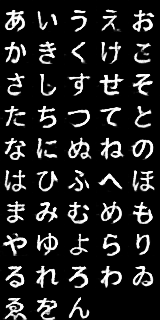
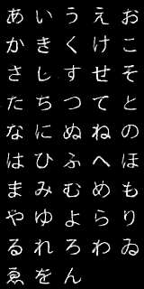
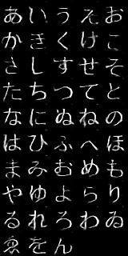
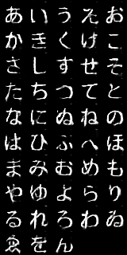
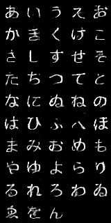
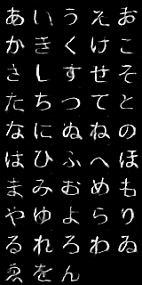

# Generating hiraganas (Japanese characters) with conditional GAN.

## Examples
These are the generated characters with 4 different latents.
### DCGAN

### Relativistic GAN

## Dependencies
- Python 3
- Chainer https://chainer.org/

## Note
You need to comment out fonts in ValidFontChar.txt that are not installed in your PC.
Commenting out is done by adding #s to the lines.

## License
MIT

## Thanks to
https://github.com/pfnet-research/chainer-gan-lib/
was very helpful.
